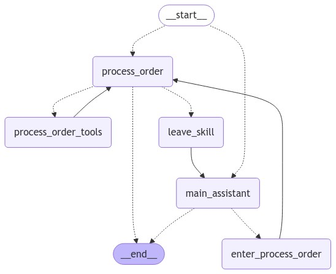

# Scalable pizza ordering multi-agent system

This project is an enhanced version from one of my previous projects (https://github.com/JaniGovanni/pizza_order_assistant). The task of this project was to build an AI agent that can handle incoming orders for a pizzeria and adds it in a structured format as a json file to a specific folder.

The JSON data should follow this schema:

```json
{
  "customer": {
    "name": "Customer Name",
    "phone": "Customer Phone Number",
    "address": "Customer Address",
  },
  "order_items": [
    {
      "pizza_name": "Pizza Name",
      "size": "Size (e.g., Small, Medium, Large)",
      "toppings": [
        "Topping 1",
        "Topping 2",
        "Topping 3"
      ]
    }
  ],
  "side": ["Side 1", "Side 2"],
  "drink": ["Drink 1", "Drink 2"],
  "total_price": 22.00,
  "special_instructions": "Any special instructions or notes"
}
```

This project takes an approach that allows scalability and further enhances reliability compared to my previous solution. It does that by using LangGraph to build a multi-agent system, which currently consists of a Main Assistant and a Order Processing Agent. These specialized sub-agents handle the different parts of the ordering process:

1. Main Assistant
   - Greets the customer and collects their name
   - Delegates to specialized sub-agents based on customer needs

2. Order Processing Agent
   - Collects pizza type, size and toppings
   - Handles sides and drinks selection
   - Gets delivery address and phone number
   - Shows order confirmation
   - Processes the final order with an implemented custom tool, which:
        1. Converts the order into the required JSON format
        2. Calculate the total price
        3. Save the order to the [orders](./app/orders/) folder as a json file.


## Core Features

- Multi-agent architecture (Human in the loop) with specialized agents for different tasks, which can be easily extended with new agents
- Implemented custom tool, which enables:
    * Input validation against available menu items
    * Structure the order into a JSON format
    * Real-time price calculation system (separated from LLM processing)
- Streamlit web interface
- Support for multiple LLM providers

## Graph architecture


## System Components


### main_assistant
- Greets customers and collects their name
- Finds out what the customer wants and passes them on to the sub_agent (currently only the functionality to take an order is implemented).
- Maintains conversation flow
- You can find the system prompt in [pizza_multi_agent/system_prompts/main_assistant_prompt.py](./pizza_multi_agent/system_prompts/main_assistant_prompt.py)


### process_order
- Collects pizza type, size and toppings
- Handles sides and drinks selection
- Gets delivery address and phone number
- Shows order confirmation (as a chat message)
- Processes the final order by using process_order_tools
- You can find the system prompt in [pizza_multi_agent/system_prompts/process_order_prompt.py](./pizza_multi_agent/system_prompts/process_order_prompt.py)


### Tools

#### process_order_tool (process_order agent)
- Structures the determined order details into the required JSON format using a LLM
- Validates the order against the menu items and the JSON schema
- Calculates the total price
- You can find the implementation in [pizza_multi_agent/defined_tools/process_order_tool.py](./pizza_multi_agent/defined_tools/process_order_tool.py)


#### back_to_main_assistant_tool (process_order agent)
- Sends the customer back to the main assistant
- You can find the implementation in [pizza_multi_agent/defined_tools/back_to_main_assistant_tool.py](./pizza_multi_agent/defined_tools/back_to_main_assistant_tool.py)


#### delegate_to_process_order_tool (main_assistant agent)
- Delegates the customer to the process_order agent
- You can find the implementation in [pizza_multi_agent/defined_tools/delegate_to_process_order_tool.py](./pizza_multi_agent/defined_tools/delegate_to_process_order_tool.py)

## Extra details

As mentioned, this project aims to demonstrate how to implement a scalable, reliable customer chat agent architecture. It was inspired by a solution presented by LangChain (https://langchain-ai.github.io/langgraph/tutorials/customer-support/customer-support/#part-4-specialized-workflows). A hierarchical multi-agent structure was implemented, where the main_assistant decides which sub-agent should handle the customer's request. Theoretically, this structure can be expanded with any number of functionalitys by adding new sub-agents or just simple python logics. It's worth noting that this solution is significantly more complex than the one presented in https://github.com/JaniGovanni/pizza_order_assistant and therefore involves significantly more code. However, the more precisely defined control flow allows for the use of less expensive models (such as Llama 3.1 70B) instead of the previously used gpt-4o-mini to reliably perform the tasks.

## How to run the project

### Create a virtual environment

```bash
python -m venv .venv
```

### Install dependencies

```bash
pip install -r requirements.txt
```

### Add an .env file with your GROQ_API_KEY

### Run the app

```bash
streamlit run main.py
```